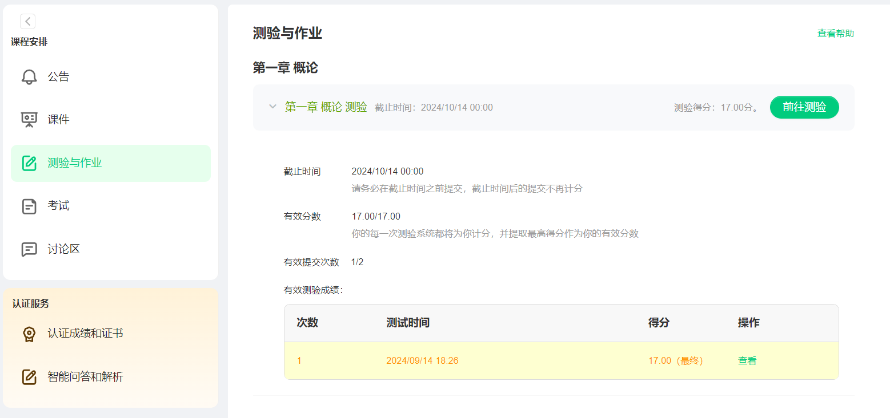

## 2024/9/15
#### 中秋节前所有任务完成
- oj 第二章线性表
- mooc 前三章
#### 发现可利用的mooc网bug
相当于免费获得无限作答次数
- 准备: 本校认证过的大号,若干小号(无需充钱,每个号相当于两次机会)
- 浏览器内先登录**大号**,到如下界面为止:

- 同一浏览器再登录**小号**(此时你的访问已经属于小号)
- 回到刚刚大号打开的**测验与作业**页面,正常做题,提交后就能看到分数
  - 区别在于,小号不充钱看不到章节分数,不确定做的对不对
- 网页都关掉,会发现这次作答被记录在了小号上,且不再显示分数
> 本人尚不会计网,无法对这个唐氏bug的成因作出合理推测.但我的评价是这网站能把比较逻辑写对已经赢太多了:thumbsdown:
# 数据结构与算法A
- 2024秋陈斌老师班
- stl and c++.md是笔记,其他是搜罗的课程资料,所有作业会及时更新

