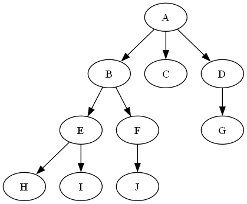

#### 1.
(1)

(A(B(E(H)(I))(F(J)))(C)(D(G)))

(2)
深度为3, 高度为4
```
TreeHeight(T): 
    if T == NULL:
        return 0
    if T.children == NULL:
        return 1
    maxHeight = 0 
    for i in T.children:
        h = TreeHeight(i)  // 递归计算每个孩子的高度
        maxHeight = max(maxHeight, h)  // 更新最大高度
    return maxHeight + 1  // 返回最大高度加一
```

(3)
```
      A
     /
    B
   / \
  E   C
 / \   \
H   F   D
\   /   /
 I J   G
```

```
ForestToBinaryTree(F): \\F = [T_1,T_2,...T_n], 输入是树时即为 [T_1]
    空二叉树根节点 T
    F_1 = [T_11,T_12,...T_1m] \\ T_1除去根节点后的森林
    F_2 = [T_2,...T_n] \\ F除去T_1后的森林
    T->leftchild = ForestToBinaryTree(F_1)
    T->rightchild = ForestToBinaryTree(F_2)
    返回 T
```

#### 2.
(1)  $n\in [\frac{K^{L-1}-1}{K-1}+1,\frac{k^L-1}{k-1}]$
(2) 假设完全$K$叉树根节点编号为 $1$ , 则编号为$N$的节点的父节点编号为 $\lfloor \frac{N-2}{K}\rfloor+1$ 
(3) 编号为$N$的节点的第 $i$ 个子节点编号为 $K(N-1)+i$ (假如该点编号没有达到总节点数)

#### 3.
归纳证明union生成的高度为 $L$ 的树的节点数是 $\Omega(2^L)$的
对于一个高度为 $k+1$ 的树T,生成该树的过程中存在一步,使得合并的两个树高度都为 $k$, 设为A,B.由归纳假设,有
$$n(T)\ge n(A)+n(B)\ge 2\min {n(A)+n(B)}\ge c\cdot 2^{k+1}=\Omega({2^{k+1}})$$
k = 1的情形显然,因此存在常数 $c$, 使得 $n(T)\ge c\cdot 2^L$
从而有 $$L\leq \log n(T) - \log c = O(\log N)$$