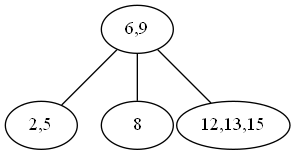
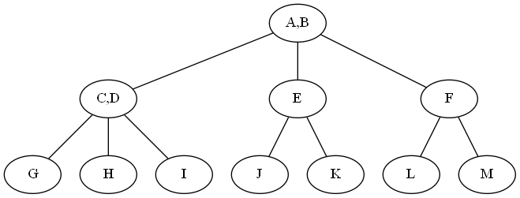
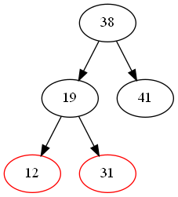
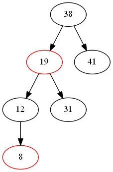

#### 1.

#### 2.
在阶为 $3$ 的 $B$ 树中，每个结点至多含有 $2$ 个关键字(至少 $1$个)，至多有 $3$ 子树. 第二层有 $4$ 个关健字，欲使 $B$ 树的结点数达到最多，则这 $4$ 个关键字包含在 $3$ 个结点中，树形如下图所示，其中 $A,\dots,M$ 表示关键字，最多有 $11$ 个结点.

#### 3.
插入19后:

插入8后:

#### 4.

1. **北京大学**：
   - 曾诚
   - 冯浩
   - 丁军

2. **清华大学**：
   - 汪涛
   - 吕鹏
   - 高飞

3. **北京邮电大学**：
   - 曹阳
   - 邵刚

4. **中国人民大学**：
   - 蔡亮
   - 梁宇
