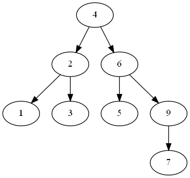
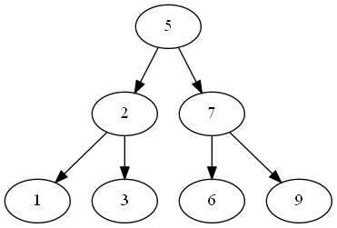
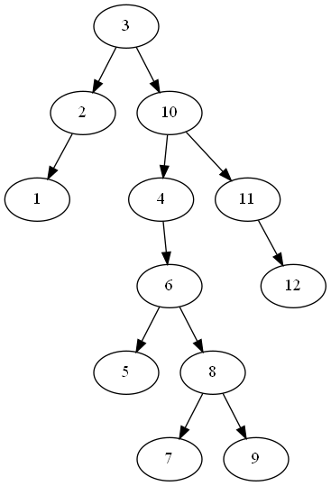
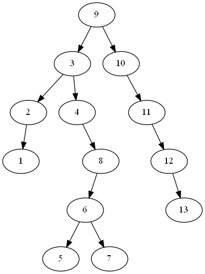
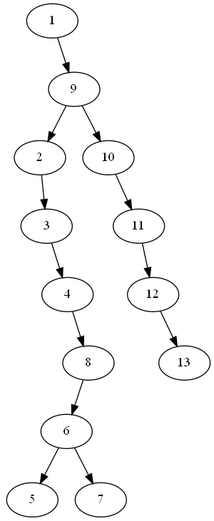
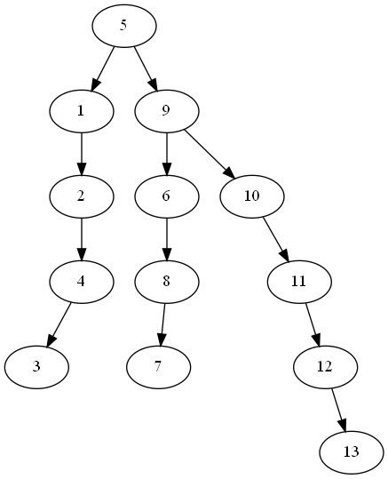

#### 1.
- 首先适配法:20MB，10MB，18MB
  - 插入 12MB，最先可用是20MB，插入后变为10MB,4MB, 8MB, 18MB, 7MB, 9MB, 12MB,15MB
  - 插入10MB，最先可用是10MB，插入后变为4MB,8MB, 18MB, 7MB, 9MB, 12MB, 15MB
  - 插入9MB，最先可用是18MB，插入后变为4MB,8MB,9MB,7MB,9MB, 12MB,15MB
- 最佳适配法:12MB，10MB，9MB
  - 插入12MB，最接近可用的是12MB，插入后变为10MB,4MB,20MB,18MB,7MB,9MB,15MB
  - 插入10MB，最接近可用的是10MB，插入后变为4MB, 20MB,18MB,7MB,9MB,15MB
  - 插入9MB，最接近可用的是9MB，插入后变为 4MB,20MB,18MB, 7MB,15MB
- 最差适配法:20MB，18MB，15MB
  - 插入 12MB，最大区域是20MB，插入后变为10MB,4MB, 8MB, 18MB, 7MB, 9MB, 12MB, 15MB
  - 插入10MB，最大的区域是18MB，插入后变为10MB,4MB, 8MB, 8MB, 7MB, 9MB, 12MB, 15MB
  - 插入9MB，最大的区域是15MB，插入后变为10MB,4MB, 8MB, 8MB, 7MB, 9MB, 12MB,6MB

#### 2.
(1)

(2)

#### 3.

|  |  |
|-----------------------------|-----------------------------|
| **查询 3**                  | **查询 9**                  |
|  |  |
| **查询 1**                  | **查询 5**                  |
