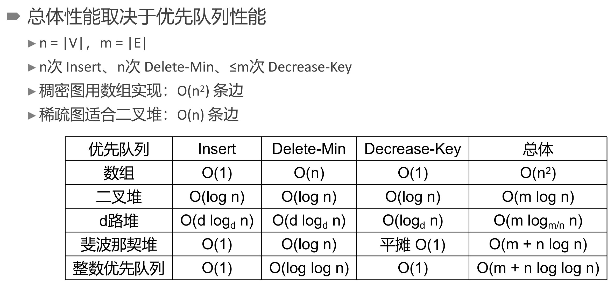

@import "/.crossnote/notes.less";

定义都很自然且高中知识居多, 因此整理不会像树那么细, 简介算法为主
# 7 图
## 7.1 定义细节
- DAG (directed acyclic graph) : 有向无环图
- 无向图中两节点间有平行边不算环, (路径长度 $\ge 3$,环=路径,不等式秒了)
  - 有向图两条边可以构成环
- 有根图 : 路径能到其他所有点
- 强连通 : 双方互有有向路径联通
  - 强连通分量 : 非强连通图的极大强连通子图
    - 强连通分量可以只有一个点
- 网络 : 带权的连通图
- adjacency matrix : 邻接矩阵
- 稀疏因子, $\delta<5$ 认为是稀疏矩阵
$$\delta = \frac{非0元素个数(t)}{矩阵大小(m\times n)}$$
## 7.2 储存
- 邻接表节省时间空间
  - 无向图的邻接表表示, 同一边出现两次即可
  - 有向图也可以有逆邻接表

**十字链表**
- 每一弧 : 头, 尾, 下一条共尾弧, 下一条共头弧, 弧权值(info域)
- 每一顶点 : data域, 第一条以该顶点为终点的弧, 第一条以该顶点为始点的弧

>稀疏矩阵的十字链表 : 行列指针序列 + 每个非0结点(值, 行后继, 列后继)
>稀疏矩阵相乘 : 遍历A的行B的列即可.

## 7.3 遍历
实质上是节点的遍历
- 解决回路和非连通图问题 : 标志位

**dfs, bfs**
- 邻接表表示 : 有向图 $\Theta (n+e)$, 无向图 $\Theta (n+2e)$
- 相邻矩阵表示 : $\Theta (n^2)$

**拓扑排序**
- 对 DAG 不断删除 $0$ 度边入队
- 邻接表表示 : $\Theta (n+e)$
- 相邻矩阵表示 : $\Theta (n^2)$

> 图算法需要考虑的问题: 有向无向, 回路, 连通性, 权值正负

## 7.4 算法
### Dijkstra单源最短路径
分成已知最短路径和未知最短路径两组, 每次找后者离前者最近的点将第二组节点逐个加入第一组. 维护 dist 数组即可.
- 朴素Dijkstra算法 : $\Theta (|V|^2)$ (每次松弛遍历 dist 数组).
  - 使用邻接矩阵表示无论如何都是 $\Theta (|V|^2)$
- 优先队列优化 : 最坏 $\Theta ((|V|+|E|)\log |E|)$, 但要具体分析, 维护优先队列只有找最小值和松弛两个操作.
- 不支持负权值, 支持负权值需要 Bellman-Ford 算法或者 SPFA 算法
### Floyd算法求所有最短路径
实际上就是动态规划, 三层 for 循环即可
$$d[i][j] = \min \{d[i][j],d[i][k]+d[k][j]\}$$
- 复杂度 $\Theta(n^3)$
### Prim算法求最小生成树
- MST (minimum-cost spanning tree)

框架与 Dijkstra 算法相同, 但距离值直接用最小边, 总时间 $O(n^2)$
- 适合稠密图, 对稀疏图可以像 Dijkstra 算法那样用堆来保存距离值.

### Kruskal算法求最小生成树
边排序然后逐个入队, 遇到破坏连通性的就跳过
最坏情况是 $\Theta (\mathrm e\log \mathrm e)$, 通常代价是 $\Theta(n\log \mathrm e)$

> 切分定理 : 对于任意分割, 跨分割的最小边一定在最小生成树中 (这导致Dijkstra算法的生成树一定与最小生成树有公共边)

    判断正误
    
对于一个包含 <b>N</b>（<b>N>1</b>）个顶点的图, 假定任意两点间最多只有一条边, 那么下列哪些情况是错误的_________. 
 
    
<b>(2016 秋)</b> A. 如果是有向图, 则其任何一个极大强连通子图都无法进行拓扑排序. 
 
    
<b>(2016 秋)</b> B. 如果是无向连通图, 假设所有边的权重均为正值, Dijkstra 算法给出的生成树不一定是最小生成树, 但是与该图的任何一个最小生成树都至少有一条相同边. 
 
    
<b>(2021 秋)</b> C. 考虑单源最短路径问题，在 Dijkstra 算法中可以利用最小堆来寻找权值最小结点，也可以不利用堆（即直接扫描距离数组）来寻找权值最小结点。对于稠密图而言，前者总是比后者在单源最短路径搜索中的复杂性要低。
 
    
<b>(2021 秋)</b> D. 最小生成树问题中，Kruskal 算法适用于稀疏图而 Prim 算法适用于稠密图。
 

**解析**: A. 强连通分量可以只有一个点. 
> 确实很多图强连通分量只有一个点这没什么可说的, 但如果问"强连通图不可以被拓扑排序"这句话的正确性, 我是回答对还是错呢, 判断题考平凡情况我评价就是没有浮木.

B. 切分定理 (ppt上是这么叫的)
CD. 
||稠密图($e\approx n^2$)|稀疏图($e\approx n$)|
|:-:|:-:|:-:|
|最小生成树|Prim, $O(n^2)$|Kruskal, $O(e\log e)$|
|Dijkstra|直接扫描, $O(n^2)$|删除旧值的最小堆, $O((n+e)\log n)$|

    (2021 秋)
    
已知带权无向连通图 <b>G=(V, E)</b> 为稀疏图, <b>|V|=n</b>, <b>|E|=m</b>, <b> m << n^2 </b>, 每条边的权
    重 <b>w∈{1, 2}</b>, 使用邻接表存储. 给定 <b>G</b> 中不同的两点 <b>s</b> 和 <b>t</b>, 它们之间存在一条权
    重和最短的路径 <b>p</b>, 请设计一个算法, 用尽可能低的时间复杂度 (不考虑空间复杂度),
    找到 <b>p</b> 上的权重之和 (不需要找到 <b>p</b>), 并给出时间复杂度分析.  
    <b>注:</b> 所给出算法的复杂度尽可能低; 只需要给出伪代码或算法流程即可, 不需要给
    出完整的代码.

**答案** :  标答给的方法2是最优的

**另** :
标答另外给了一个方法1, 指出使用Dijsktra算法时, 所谓"删除旧值的最小堆"的时间复杂度是 $O((n+m)\log n)$, "不删除旧值的最小堆"的时间复杂度是  $O((n+m)\log m)$, 可能比前者劣, 因此此时最优的是利用"删除旧值的最小堆"实现的Dijsktra算法. 
我认为这个答案很不严谨, 首先 $m\ll n^2$ 没法定具体范围, 其次如果稀疏图下仍然认为 $O(m)>O(n)$ (或者说至少 $0.5+\epsilon$ 的概率认为 $m>n$), 使用斐波那契堆优化到 $O(m+n\log n)$ 更优. 此外, 不显示删除旧值的delete-key次数是最坏 $m$ 次, 显示删除旧值的delete-key次数一定为 $m$ 次, 后者为堆变小付出了额外的代价, 两边代价谁更大, 仅凭复杂度上界分析还未可知. 

> 
> *该页来自 2023春 算法设计与分析(实验班)*

算分似乎在操作中将 $n$ 和 $m$ 混淆, 而在操作次数上将 $n$ 和 $m$ 分开.
___