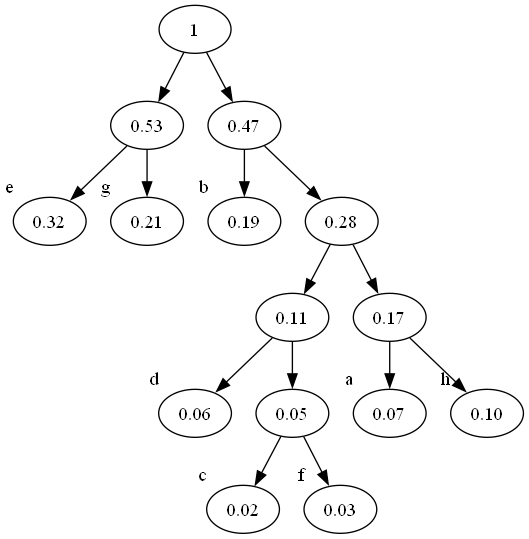
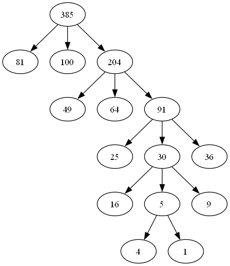

#### 1.
```
        A
      /   \
     B     G
    / \   / 
   C   D H
      / \ \
     E   F I
          /
         J
          \
           K
```  

#### 2.
对任意两个叶子节点 $a,b$,  考虑两节点路径的最后一个重合节点, 设为 $r$, 则$a,b$ 分别属于 $r$的左右子树, 不妨设 $a$ 在左子树, $b$ 在右子树
无论哪种遍历方法, 对节点 $r$ ,都有先遍历 $r$ 的左子树, 后遍历 $r$ 的右子树, 因此先遍历 $a$ 后遍历 $b$. 从而所有叶节点的次序与遍历方法无关.

#### 3.
(1)
哈夫曼树是满二叉树, 因此 199 = 叶子节点数 + 内部节点数 = 2*叶子节点数 -1 
从而叶子节点数是100

(2)
假设这8个字母分别是a,b,c,d,e,f,g,h. 则二叉huffman树如下:


对应的编码为
|a|b|c|d|e|f|g|h|
|-|-|-|-|-|-|-|-|
|1110|10|11010|1100|00|11011|01|1111|

(3)
0-7的二进制编码是一种等长编码
1. 编码长度
- **Huffman编码**: 根据字母的频率生成变长编码, 频率高的字母用较短的编码, 通常能减少整体编码长度.
- **等长编码**: 每个字母都用相同长度的编码, 可能会导致空间浪费. 

2. 压缩效率
- **Huffman编码**: 能有效压缩信息, 特别是字母频率差异较大的情况下. 
- **等长编码**: 压缩效率低, 尤其是频率分布不均时, 可能无法有效利用编码长度. 

3. 复杂性
- **Huffman编码**: 编码和解码过程相对复杂, 需要构建赫夫曼树. 
- **等长编码**: 编码和解码过程简单, 易于实现. 

4. 适用场景
- **Huffman编码**: 适合用于频率差异明显的数据压缩. 
- **等长编码**: 适合数据频率较为均匀的情况或需要简单实现的场景. 


#### 4. 
(1)
第一步
```
           503
        /       \
       87       512
     /    \     /  \
    61    908  170 897  
   / \    /
 275 653 462
```
最后一步(最小堆建成)
```
           67
        /       \
       87       170
     /    \     /  \
   275    462  512 897  
   / \    /
 503 653 908
```
(2)
在某个叶子节点上, 否则节点的子女中含有比该节点更大的关键码. 实际上, 在最小堆蕴含的所有偏序关系中,只有叶子节点始终不作为更小的元素

(3)
```
Heapify(array):
    n = array.length()
    for (i = n/2-1; i>=0; i--): \\遍历内部节点
        Siftdown(array, i, n)

Siftdown(array, index, n):
    smallest = index
    left = 2*index+1
    right = 2*index+2
    if (left<n AND array[left]<array[smallest])
        smallest = left
    if (right<n AND array[right]<array[smallest])
        smallest = right
    if smallest != index:
        SWAP(array[smallest], array[index])
        Siftdown(array, smallest, n) \\保子树的最小堆性质
```
根据以上建堆的伪代码, 每次siftdown的非递归部分蕴含了两次数值比较 (实际上, 每个小值的上浮需要对节点和其子女三个值做比较)
注意到树的深度是 $\lfloor\log n\rfloor$ , 我们对最坏情况下总上浮次数(即每次调用siftdown函数都引起了上浮)算两次:
$$
\begin{align*}
最坏情况下总上浮次数 &= \sum_{i=0}^{\lfloor\log n\rfloor} 2^i (\lfloor\log n\rfloor-i)\\ &= 2^{\lfloor\log n\rfloor+1}-\lfloor\log n\rfloor \\
2\times 最坏情况下总上浮次数 &= 比较次数 
\end{align*}
$$
注意到 $2^{\lfloor\log n\rfloor}\leq n$, 因此有
$$C_0=\sup_{n\in \mathbb N} \frac{比较次数}{n}=\sup_{n\in \mathbb N} \frac{2(2^{\lfloor\log n\rfloor+1}-\lfloor\log n\rfloor)}{n}=4$$
> 课件上疑似放反了, 因为这里能用的不等式是 $2^{\lfloor\log n\rfloor}\leq n$ 而非 $n\leq 2^{\lceil \log (n+1)\rceil}-1$ 虽然两个高斯函数值可以用于计算完全二叉树的高度

#### 5.
```
struct TreeNode {
    int weight;
    vector<TreeNode*> children;
    TreeNode(int w) : weight(w) {}
};

// 比较函数，用于优先队列
struct Compare {
    bool operator()(TreeNode* a, TreeNode* b) {
        return a->weight > b->weight; // 小根堆
    }
};

// 构造 k 叉树
TreeNode* BuildKaryTree(vector<int>& weights, int k) {
    priority_queue<TreeNode*, vector<TreeNode*>, Compare> pq;

    // 将权重放入优先队列
    for (int weight : weights) {
        pq.push(new TreeNode(weight));
    }
    // 传入虚空叶子
    for (int i=0 ; i< (weigits.size()-1)%(k-1) ; i++){
        pq.push(new TreeNode(0));
    }

    // 直到队列中只剩一个节点
    while (pq.size() > 1) {
        vector<TreeNode*> children;

        // 从队列中取出 k 个最小权重的元素
        for (int i = 0; i < k && !pq.empty(); ++i) {
            children.push_back(pq.top());
            pq.pop();
        }

        // 创建新节点，其权重为子树权重之和
        int newWeight = 0;
        for (TreeNode* child : children) {
            newWeight += child->weight;
        }
        TreeNode* newNode = new TreeNode(newWeight);
        newNode->children = children;

        // 将新节点插入回优先队列
        pq.push(newNode);
    }

    // 返回根节点
    return pq.top();
}
```
如上述代码所示, 将带权节点传入优先队列, 每次取最小的k个, 建立新节点以这k个节点为子节点, 权重为这k个节点之和. 重复该操作直至优先队列内元素个数刚好为1 (为保证这一点需要提前在优先队列里加 (m-1)%(k-1) 个权重为0的虚空叶子), 最后一个元素即为最优k叉树的根
对1,4,9,16,25,36,49,64,81,100构造的三叉树为:

最小加权路径长度是705