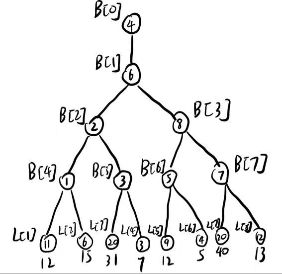
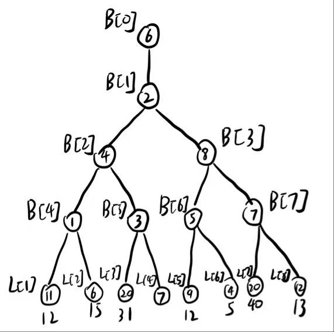

## 一
|1|2|3|4|5|6|7|8|
|---|---|---|---|---|---|---|---|
|B|D|CE,ABE,AB|4|110,114,119,120,122,763|3,7-9-10,4-5-6-8,1-2-3|AD|836|
## 二
#### 1.
(1) 对边按权值排序:
- $w = 1$ : (0,1), (0,3)
- $w = 2$ : (3,4)
- $w = 3$ : (2,4)
- $w = 4$ : (0,4), (1,3)

由于点 $0$ 一定是叶子, 则不含点 $0$ 的前三条边是 (3,4), (2,4), (1,3), 不成环, 加上权值为 $1$ 的含 $0$ 边 (0,1) 或 (0,3) 均不成环, 故解得两棵最小生成树:
- $T_1 = \{(0,1), (1,3), (2,4), (3,4)\}$
- $T_2 = \{(0,3), (1,3), (2,4), (3,4)\}$

(2) 深度优先搜索并记录节点权值剪枝, 记录层数作为终止条件, 得到最短路径: $1 \xrightarrow{1} 0 \xrightarrow{4} 4 \xrightarrow{3} 2$

#### 2.
$120-1\equiv -2 \,(\text{mod }(12-1))$, 补充两个虚段即可

#### 3.
|  |  |
|-------------------------|-------------------------|

#### 4.
由于负载因子是 $\alpha = \frac{8}{11}$, 因此 $L = \frac{8}{\alpha} = 11$
| 0 | 1 | 2 | 3 | 4 | 5 | 6 | 7 | 8 | 9 | 10 |
|---|---|---|---|---|---|---|---|---|---|----|
|14|17||16|9|23|4|||2|11|

#### 5.
(1) 三次读盘, 分别读 (4,12), (8,10), (5,6)
(2) 0次读盘, 因为 (4,12), (8,10), (5,6) 读过了,  查找失败
(3) 
- 首先查找 7, 分别读 (4,12), (8,10), (5,6), 但是都读过了
- 节点 (5,6) 插入 7 后分裂, 左节点 (5,\), 右节点 (7,\), 6 上升, 写两次盘
- 节点 (8, 10) 插入 6 后分裂, 左节点 (6,\), 右节点 (10,\), 8 上升, 写两次盘
- 节点 (4, 12) 插入 8 后分裂, 左节点 (4,\), 右节点 (12,\), 8 上升, 写两次盘
- 产生新的根节点 (8, \), 写一次盘

总共读盘 0 次, 写盘 7 次, 访外共 7 次

(4) 对于 3 阶 B 树, 首先查找插入元素的位置, 最多此处恰与层数 $h$ 相等, 插入后假如总是会导致上层分裂, 每层产生 2 次写盘, 顶层分裂后产生新的根节点, 再写一次盘, 一共 $2h+1$ 次写盘.

因此一次插入操作最多读盘 $h$ 次, 写盘 $2h+1$ 次, 访外共 $3h+1$ 次

#### 6. 
对于 $h>5$ , 有限步结束一定不是最坏情况, 最坏的情形是矛盾向上递归.
- 在 $h+1$ 层插入新的红色节点 $x$ , 如果其父为黑, 结束
- 如果其父为红, 则其祖父为黑, 若其叔为黑
  - 若 $x$ 与其叔同侧(相对于各自的父节点), 单旋一次父亲转化为异侧
  - 若 $x$ 与其叔异侧, 单旋一次祖父, 结束
- 以上两种情况都解决了两层的矛盾, 最多旋转 $2$ 次, 且结束插入程序
- 若其叔为红, 将其祖父染红并递归地向下换色, 此时 $x=x\to $ 祖父, 向上递归, 这一情形无需旋转
- 综上, 最坏情况下红黑树一次插入旋转次数不超过 $2$

## 三
#### 1.
```i == j && len == 0 ```, ```sum += GetPathNum_Len(G, v, j, len - 1)```
#### 2.
```q==index;```, ```q<index```, ```SelectK(a,l,q-1,index)``` 

## 四
#### 1.
设红色为 $0$, 蓝色为 $1$,
维护一个二维数组dist, dist[i][j] 表示从起点 $0$ 出发, 最后一条边为颜色 $i$, 且最后一个点为 $j$ 的最短路径长度. 再维护一个而维数组visited, visited[i][j] 表示是否以颜色 $i$ 到达过点 $j$.
初始化数组的元素为 $+\infty$, dist[1][0] 和 dist[0][0] 为 $0$. 
使用广度优先搜索, 首先将 $(0,0)$ 和 $(0,1)$ 入队, 每次取出 $(a,b)$ 时, 遍历邻接表列索引为 $b$ 的行, 对每个满足 $b\xrightarrow{1-a}c$ 的点:
- 若 visited[1-a][c] 为 $0$, 则更新 dist[1-a][c] = min(dist[a][b] + 1, dist[1-a][c]), 并将 $(1-a,c)$ 入队, visited[1-a][c] 置 $1$
- 若 visited[1-a][c] 为 $1$, 则跳过

当队列为空时, 对每个点 $i$, 取 dist[0][i] 和 dist[1][i] 的最小值即为所求最短交替色路径长度

#### 2.
(1)


(2)
```cpp
Delete(H, x):
    // 首先确保 x 在 H 上, 如果不在, 则返回删除失败, 题目没有给定是否需要考虑这种情况
    if x->father->leftchild == x:
        x->father->leftchild = Merge(x->leftchild, x->rightchild)
    else:
        x->father->rightchild = Merge(x->leftchild, x->rightchild)
    return
```